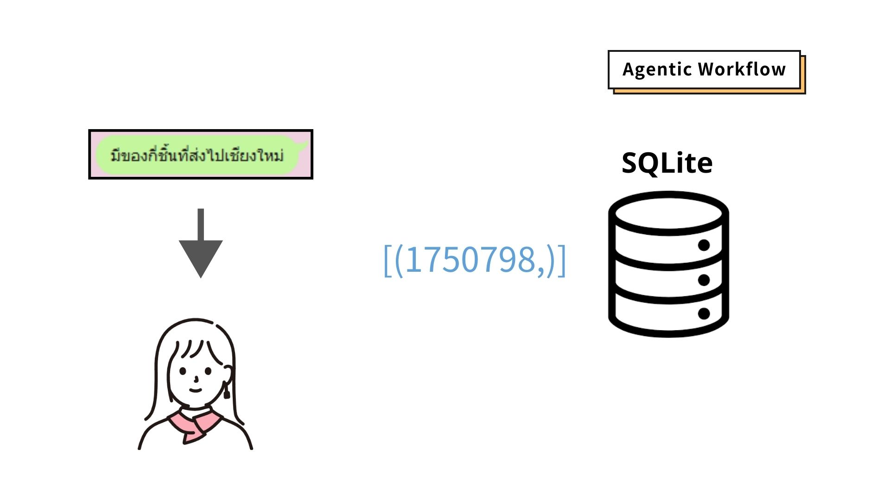

# LLMQueryBot

This repository archives all the code for the project I participated in for the Chiang Mai University Data Science Project Contest 2024, where me and my friends achieved first place.

